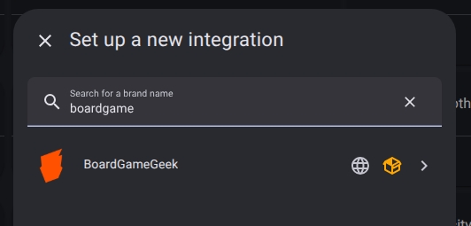

#  BoardGameGeek  (BGG Sync)

[![GitHub Release][releases-shield]][releases] [![License][license-shield]](LICENSE) [](https://github.com/hacs/integration) [](https://github.com/seanmccabe/bgg-sync/actions/workflows/tests.yaml)

BoardGameGeek (BGG) integration for Home Assistant. A robust custom component for verifying and tracking plays and collection data. It creates sensors for your play counts and collection, and provides a service to record plays directly from Home Assistant.

<a href="https://boardgamegeek.com">
  <picture>
    <source media="(prefers-color-scheme: dark)" srcset="brand_images/dark_logo.png">
    
  </picture>
</a>

## Features

*   **Game Tracking**: Option to track specific games (by ID) to get dedicated sensors with rich metadata (Box Art, Rank, Year, weight and more)!
*   **Shelf Tracker**: View your full collection as a Home Assistant To-do List.
*   **Play Logging**: Includes an action to log plays to your BGG account.
*   **Multi-User**: Supports tracking multiple BGG accounts.
*   **Wishlist Monitoring**: Dedicated sensors to track the size of your collection, Owned, Want-to-own, Wishlist and more!
*   **Custom Attributes**: Add custom attributes including nfc_tag and music to your sensors to track additional information about your games and create amazing automations.
*   **Direct API Integration**: Uses the BGG XML API2 directly (no third-party library dependencies) for maximum reliability.
*   **Authentication Support**: Supports BGG's new API Token requirement for data fetching.
*   **Smart Polling**: Updates every 30 minutes to respect BGG's rate limits and server load.

## Installation

1.  Ensure you have [HACS](https://hacs.xyz/) installed.
2.  Add this repository as a [Custom Repository](https://hacs.xyz/docs/faq/custom_repositories) in HACS.
3.  Search for "BoardGameGeek" (or BGG Sync) and download it.
4.  Restart Home Assistant.

*Note: Submission to HACS is in the works.*


## Configuration

1.  Go to **Settings** > **Devices & Services**.
2.  Click **Add Integration** and search for "BoardGameGeek".
3.  Enter your **BGG Username**.
4.  **API Token (Required for Sensors)**:
    *   Go to [BGG Applications](https://boardgamegeek.com/applications).
    *   Register a new application (e.g., "Home Assistant").
    *   Click "Tokens" and generate a new token.
    *   Paste this token into the configuration dialogue.
5.  **Enable Play Logging**:
    *   Check this box if you want to use the `bgg_sync.record_play` service to log plays to BGG.
6.  **Password**:
    *   Enter your BGG password. This is ONLY required if "Enable Play Logging" is checked.



IF you want to turn on Collection tracking and not just via the to-do list, you will need to enable the "Track Collection" option.

1.  Go to **Settings** > **Devices & Services**.
2.  Search for "BoardGameGeek" and click on it.
3.  Click on the Cog icon for the user you want to enable collection tracking for.
4.  Enable the "Track Collection" option.
5.  Submit.

**Note:** Collection tracking can take a few minutes to populate. In large collections this can great hundreds of sensors, so it may take a while and may cause degradation in performance.


## Sensors


The integration creates the following sensors:

*   `sensor.bgg_sync_{username}_plays`: Total number of plays recorded.
    *   *Attributes*: `last_play` (Object containing: `game`, `game_id`, `date`, `comment`).
*   `sensor.bgg_sync_{username}_collection`: Total number of games in your collection (owned).
*   `sensor.bgg_sync_{username}_{list_type}`: Counts for various lists:
    *   `owned_boardgames`, `owned_expansions`
    *   `wishlist`, `want_to_play`, `want_to_buy`, `for_trade`, `preordered`
*   `sensor.{game_name}` (optional): A rich sensor for a specific tracked game.
    *   **State**: Total Plays.
    *   **Entity Picture**: The authentic game box art from BGG (or your custom override).
    *   **Attributes**:
        *   `bgg_id`, `bgg_url`, `image_url`
        *   `rank`, `year`, `weight`, `rating`, `bayes_rating`
        *   `min_players`, `max_players`
        *   `playing_time`, `min_playtime`, `max_playtime`
        *   `users_rated`, `owned_by`, `sub_type` (boardgame/expansion)
        *   `coll_id` (collection ID if owned)
        *   `nfc_tag` (custom), `music` (custom)
        *   `custom_image` (functional, overrides entity picture)

## Services

### `bgg_sync.track_game`

Dynamically adds a game to your tracked list without restarting Home Assistant.

**YAML Example:**

```yaml
service: bgg_sync.track_game
data:
  bgg_id: 822
  nfc_tag: "04-14-98-B2-84-2A-81"
  music: "spotify:playlist:3eFSbK6WDyledAmEvtmb3t"
  custom_image: "/local/boardgames/carcassonne.webp"
```

**Arguments:**

*   `bgg_id` (Required): The BoardGameGeek ID of the game.
*   `nfc_tag` (Optional): A clean tag ID to associate with this game (useful for automations).
*   `music` (Optional): A Spotify URI, URL, or search term for background music.
*   `custom_image` (Optional): A URL or local path (`/local/...`) to override the default BGG box art.
*   `username` (Optional): If you have multiple BGG accounts synced, specify which one this game belongs to.

### `bgg_sync.record_play`

Records a play to your BoardGameGeek account.

**YAML Example:**

```yaml
service: bgg_sync.record_play
data:
  username: "your_bgg_username"
  game_id: 822  # Carcassonne
  date: "2026-01-01"
  length: 60
  comments: "Great game!"
  players:
    - name: "Player One"
      username: "bgg_user_1"
      win: true
    - name: "Player Two"
      username: "bgg_user_2"
      win: false
```

**Arguments:**

*   `username` (Required): The BGG username to log the play for (must be configured in the integration).
*   `game_id` (Required): The BGG ID of the game played.
*   `date` (Optional): Date of the play (YYYY-MM-DD). Defaults to today.
*   `length` (Optional): Duration in minutes.
*   `comments` (Optional): Comments about the play.
*   `players` (Optional): A list of players. Each player can have:
    *   `name`: Display name.
    *   `username`: BGG Username (optional).
    *   `win`: Boolean (true/false) for winner status.

## Troubleshooting

### Sensors show "Unavailable" or 401 Errors
Ensure you have provided a valid **API Token**. BGG has tightened security and requires this token for most XML API requests. Check your configuration via "Configure" in the Integrations page.

### Play Logging fails
The integration uses a specialised API login method. If you change your password, you must update it in the integration options. If logs show "Login failed," ensure your credentials are correct.

### Enable Debug Logging

To help troubleshoot issues, you can enable debug logging via the **Enable Debug Logging** button on the integration page, or by adding the following to your `configuration.yaml`:

```yaml
logger:
  default: info
  logs:
    custom_components.bgg_sync: debug
```

## Future Features (Roadmap)

The following features are planned for upcoming releases:
*   **"Hotness" Sensor**: Track the top trending games on BoardGameGeek.
*   **User Stats**: Advanced user metrics including H-Index and Trade Rating.

---

## Development & Testing

This project includes a comprehensive test suite covering the coordinator, config flow, sensors, and services. We aim for high test coverage (>= 99%) to ensure reliability.

To run the tests locally:

1.  **Install test dependencies**:
    ```bash
    pip install -r requirements_test.txt
    ```

2.  **Run tests with coverage**:
    ```bash
    PYTHONPATH=. pytest --cov=custom_components.bgg_sync --cov-report term-missing tests/
    ```

3.  **Run pre-commit hooks** (Linting & Formatting):
    ```bash
    pre-commit run --all-files
    ```

---

## Disclaimer & Trademarks

**BoardGameGeek (BGG Sync)** is an independent open-source project and is not affiliated with, maintained by, or endorsed by BoardGameGeek, LLC.

* **BoardGameGeek** and **BGG** are registered trademarks of BoardGameGeek, LLC.
* This integration uses the BoardGameGeek XML API2 but is not an official BoardGameGeek product.
* All board game data and imagery provided through this integration are the property of their respective owners and BoardGameGeek.

[releases-shield]: https://img.shields.io/github/release/seanmccabe/bgg-sync.svg?style=for-the-badge
[releases]: https://github.com/seanmccabe/bgg-sync/releases
[license-shield]: https://img.shields.io/github/license/seanmccabe/bgg-sync.svg?style=for-the-badge
